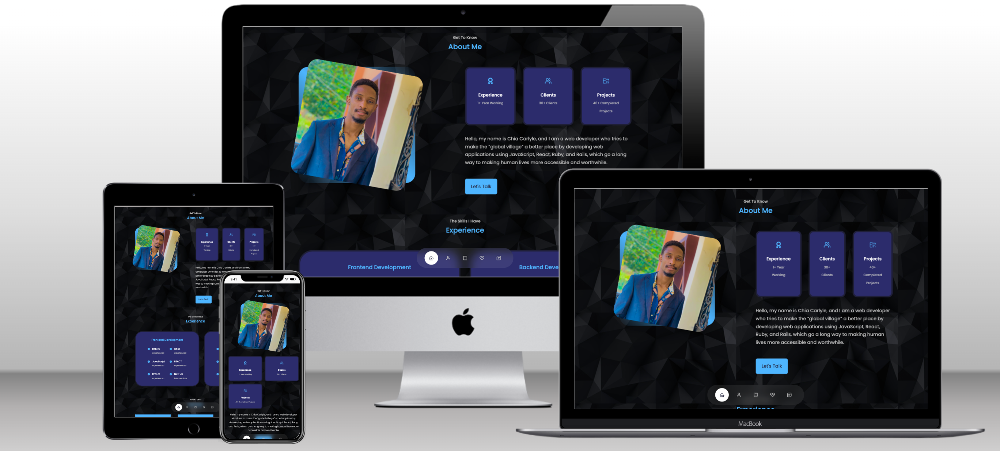

#  PORTFOLIO SITE

> This repository is the official home of Chia Carlyle's portfolio website. This site is aimed at showcasing the author's skills, and providing evidence of these skills by providing links to projects he's worked on. Visit the deployed site to learn more about the author, download his resume, and contact him with any offers.

## Peek Shots

## Built With

- React
- HTML, CSS, JavaScript
- npm, webpack

## Live Demo

https://carlylesportfolio.vercel.app/

## Getting Started

To get a local copy up and running follow these simple example steps.
for https:
`git clone https://github.com/carlylechia/portfolio-website.git`

### Install

 after cloning the repo run 
 `npm install`

### Usage
   run 
 `npm start` for devlopment
 `npm run build` for production code

## Authors

👤 **Chia Carlyle**

- GitHub: [@CarlyleChia](https://github.com/CarlyleChia)
- Twitter: [@ChiaCarlyle](https://twitter.com/ChiaCarlyle)
- LinkedIn: [LinkedIn](https://www.linkedin.com/in/chia-carlyle/)

## 🤝 Contributing

Contributions, issues, and feature requests are welcome!

Feel free to check the [issues page](https://github.com/carlylechia/portfolio-website/issues).

## Show your support

Give a ⭐️ if you like this project!

## Acknowledgments

- A big THANK YOU to all my teammates who wrote recommendations for me.
- I'm grateful to every mentor I've had in this remarkable journey.

## 📝 License

This project is [MIT](./LICENSE) licensed.
